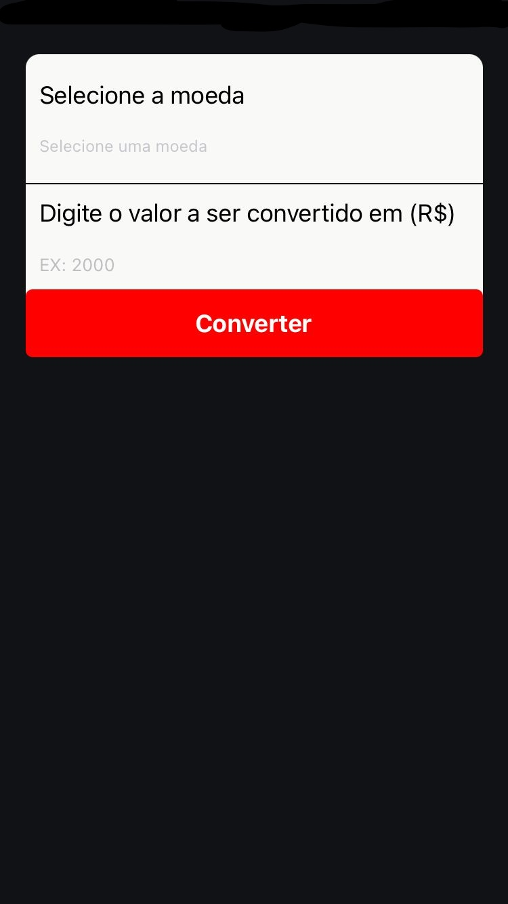
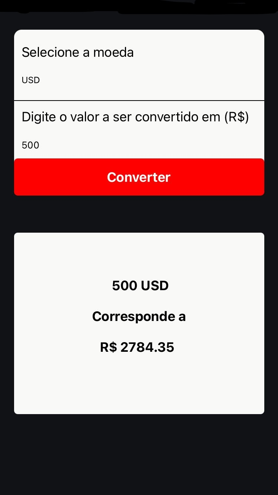

# Conversor de moeda
## Projeto desenvolvido usando expo onde converte qualquer moeda existente para Reais.

### Utilizando a api abaixo para fazer a requisição.
[Economia-Api](https://economia.awesomeapi.com.br/)

<!-- ## Views

 -->

| 
 Init 
 | 

 |
|---------------|--------------|
| |  |

 Desenvolvido por Daniel Cunha <3 
